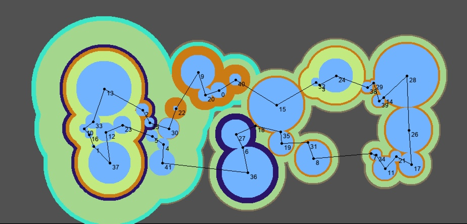
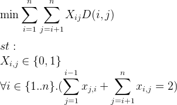
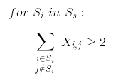

# Traveling Salesman Problem Visualizer 

This project is a TSP visualizer that uses Integer Linear Programming (branch and bound method) to find the approximate shortest tour that visits each city only once. Typically, the path will not be found in the first iteration, so we need to find the relevant constraints since the number of possible combinations is exponential. The subtour-elimination constraints will be found via DFS, and the process is repeated until a tour is found.

While the program is running, it is also solving for the dual of the problem (primal is to minimize the distance, dual is to maximze the width (distance) of the city). It uses the subtours of the primal to create new constraints for the dual.

In short, the relationship of the dual to the primal can be summed up as a different view of the objective function. For example, if we wanted to maximize the space of a storage unit as our objective function, the dual would be to minimize the amount of space in the storage unit. Mathematically, each variable in the primal LP becomes the constraint in the dual. Each constraint in the primal becomes a variable in the dual. It works beautifully that the variables in our dual happen to be the size of each city!




## The Primal (finding the tour)
Let's say we have number of cities n and for two cities, i and j, we let x(i,j) be whether or not we choose to use the city. If the city is used: x(i,j) = 1. If it is not: x(i,j) = 0. To calculate the length of the tour, we calculate the distance of each city and all possible paths from that city and whether or not the city is used. We observe that for every city and its corresponding possible paths, it will sum up to 2 because we have to enter and exit each city exactly once.
```
It can be written as:
```


However, this will not find you the tour when the LP solver is used. Because we are trying to minimize distances, it will calculate subtours, or separate groupings of cities, in the first iteration. We want to force the subtours to connect to each other, and to do that, we add new constraints. For every city in a subtour that is added to another city outside of that subtour, the new inequality must be greater than or equal to 2.
```
It can be written as:
```


We then keep iterating until we have no subtours left. Keep in mind that past constraints must be kept in new iterations.

## The Dual (size of the city)
The objective function of the dual is set up so that each width (2*radius) of a city does not overlap another while trying to maxmize the size of each city.
```
It can be written as:
```


For suceeding iterations, we use the subtours to add additional constraints to the dual. We add an additional variable Ys to the constraint inequalities so that the radius of city i to city j plus the "moat" Ys_i and Ys_j is <= D(i,j). This is repeated until the tour for the primal is found. Keep in mind that we must keep the constraints from previous tours in the new constraints.
```
It can be written as:
```


## Resources
http://www.math.uwaterloo.ca/tsp/methods/opt/zone.htm

https://www.epfl.ch/labs/dcg/wp-content/uploads/2018/10/13-TSP.pdf

The Traveling Salesman Problem: A Computational Study (W. Cook)


